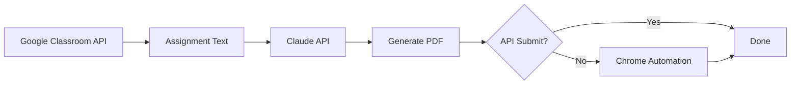

# AI Homework System

[](https://www.python.org/)
[](LICENSE)
[](https://github.com/bekirkocaman/yapay-zeka-odev)

A Python automation tool that reads Google Classroom assignments, generates answers using AI, and automates the submission process.

> **Warning:** This tool is intended for educational and personal automation purposes. You are responsible for using it in compliance with your institution's academic integrity policies.

---

## Features

| Feature | Description |
|---------|-------------|
| Classroom API | Automatically lists active courses and assignments |
| Content Reading | Reads Drive PDFs/Word docs, description links, and YouTube materials |
| AI Answers | Generates B1-level English answers using Anthropic Claude |
| PDF Output | Creates formatted assignment PDFs with ReportLab |
| Submission | Primary: Classroom API; Fallback: Chrome + Drive search |
| Logging | `teslim_edilenler.txt` prevents duplicate submissions |

---

## Architecture



---

## Requirements

- Python **3.10+**
- Google account (with Classroom access)
- [Google Cloud](docs/GOOGLE_SETUP.md) OAuth `credentials.json`
- [Anthropic API](https://console.anthropic.com/) key
- Google Chrome + `chromedriver.exe` (for fallback submission)

---

## Setup

### 1. Clone the repository

```bash
git clone https://github.com/bekirkocaman/yapay-zeka-odev.git
cd yapay-zeka-odev
```

### 2. Virtual environment

```powershell
python -m venv venv
.\venv\Scripts\activate
pip install -r requirements.txt
```

```bash
# Linux / macOS
python3 -m venv venv
source venv/bin/activate
pip install -r requirements.txt
```

### 3. Environment variables

```powershell
copy .env.example .env
```

Fill in your `.env` file:

| Variable | Required | Description |
|----------|----------|-------------|
| `ANTHROPIC_API_KEY` | Yes | Claude API key |
| `GOOGLE_EMAIL` | Yes | Google account for Chrome automation |
| `GOOGLE_PASSWORD` | Yes | Google account for Chrome automation |
| `API_KEY` | No | Gemini key for `radar.py` |

### 4. Google OAuth

Detailed steps: **[docs/GOOGLE_SETUP.md](docs/GOOGLE_SETUP.md)**

```powershell
python auth.py
```

This generates `token.json`.

### 5. ChromeDriver

Download the `chromedriver.exe` matching your Chrome version from [Chrome for Testing](https://googlechromelabs.github.io/chrome-for-testing/) and place it in the project root.

---

## Usage

```powershell
python main.py
```

When `DERSLER = []` in `main.py`, only **active** Classroom courses are processed. You can specify course IDs for specific courses.

```python
DERSLER = ["822363912140"]  # example: single course
ATLANACAK_DERS_KELIMELERI = ["grammar"]  # skip courses containing these keywords
SON_KAC_GUN = 14  # process assignments from the last N days
```

### Helper Scripts

| Command | Description |
|---------|-------------|
| `python auth.py` | Refresh OAuth token |
| `python radar.py` | Gemini API model list (test) |

---

## Project Structure

```
yapay-zeka-odev/
├── main.py              # Main automation script
├── auth.py              # Google OAuth login
├── radar.py             # Gemini model test tool
├── requirements.txt
├── .env.example
├── docs/
│   └── GOOGLE_SETUP.md
└── .github/
    ├── workflows/ci.yml
    └── ISSUE_TEMPLATE/
```

**Should not be in the repo** (excluded via `.gitignore`): `.env`, `credentials.json`, `token.json`, `venv/`, `chrome_profile/`, `HW_*.pdf`

---

## Troubleshooting

| Issue | Solution |
|-------|----------|
| `Class not found` | Outdated assignment link; use `DERSLER = []` for current courses |
| `404` course error | Course ID is outdated; enable automatic API listing |
| `.env` missing warning | Copy `.env.example` → `.env` |
| Add button not found | Check `hata_*.png` screenshot; Chrome account must match API account |

---

## Contributing

Contributions are welcome! Please see [CONTRIBUTING.md](CONTRIBUTING.md).

---

## License

This project is licensed under the [MIT License](LICENSE).

---

## Contact

**Bekir Kocaman** — [GitHub @bekirkocaman](https://github.com/bekirkocaman)
