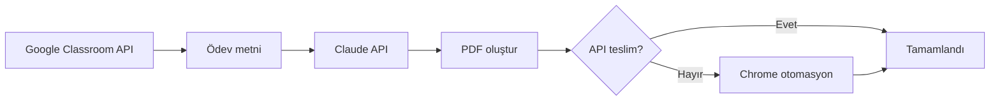

# Yapay Zeka Ödev Sistemi

[](https://www.python.org/)
[](LICENSE)
[](https://github.com/bekirkocaman/yapay-zeka-odev)

Google Classroom ödevlerini okuyan, yapay zeka ile cevap üreten ve teslim sürecini otomatikleştirmeyi deneyen Python otomasyon projesi.

> **Uyarı:** Bu araç eğitim ve kişisel otomasyon amaçlıdır. Kurumunuzun akademik dürüstlük kurallarına uygun kullanım sizin sorumluluğunuzdadır.

---

## Özellikler

| Özellik | Açıklama |
|--------|----------|
| Classroom API | Aktif dersleri ve ödevleri otomatik listeler |
| İçerik okuma | Drive PDF/Word, açıklama linkleri ve YouTube materyalleri |
| AI cevap | Anthropic Claude ile B1 seviye İngilizce cevap üretimi |
| PDF çıktı | ReportLab ile düzenli ödev PDF’i |
| Teslim | Önce Classroom API; gerekirse Chrome + Drive arama yedek yolu |
| Kayıt | `teslim_edilenler.txt` ile tekrar teslimi önleme |

---

## Mimari



---

## Gereksinimler

- Python **3.10+**
- Google hesabı (Classroom erişimi)
- [Google Cloud](docs/GOOGLE_SETUP.md) OAuth `credentials.json`
- [Anthropic API](https://console.anthropic.com/) anahtarı
- Google Chrome + `chromedriver.exe` (yedek teslim için)

---

## Kurulum

### 1. Depoyu klonlayın

```bash
git clone https://github.com/bekirkocaman/yapay-zeka-odev.git
cd yapay-zeka-odev
```

### 2. Sanal ortam

```powershell
python -m venv venv
.\venv\Scripts\activate
pip install -r requirements.txt
```

```bash
# Linux / macOS
python3 -m venv venv
source venv/bin/activate
pip install -r requirements.txt
```

### 3. Ortam değişkenleri

```powershell
copy .env.example .env
```

`.env` dosyasını doldurun:

| Değişken | Zorunlu | Açıklama |
|----------|---------|----------|
| `ANTHROPIC_API_KEY` | Evet | Claude API anahtarı |
| `GOOGLE_EMAIL` | Evet | Chrome otomasyon girişi |
| `GOOGLE_PASSWORD` | Evet | Chrome otomasyon girişi |
| `API_KEY` | Hayır | `radar.py` için Gemini anahtarı |

### 4. Google OAuth

Detaylı adımlar: **[docs/GOOGLE_SETUP.md](docs/GOOGLE_SETUP.md)**

```powershell
python auth.py
```

`token.json` oluşturulur.

### 5. ChromeDriver

[Chrome for Testing](https://googlechromelabs.github.io/chrome-for-testing/) sürümünüze uygun `chromedriver.exe` dosyasını proje köküne koyun.

---

## Kullanım

```powershell
python main.py
```

`main.py` içinde `DERSLER = []` iken yalnızca **aktif** Classroom dersleri işlenir. Belirli dersler için ID listesi verebilirsiniz.

```python
DERSLER = ["822363912140"]  # örnek: tek ders
ATLANACAK_DERS_KELIMELERI = ["grammar"]  # isimde geçen dersler atlanır
SON_KAC_GUN = 14  # son N gün içindeki ödevler
```

### Yardımcı scriptler

| Komut | Açıklama |
|-------|----------|
| `python auth.py` | OAuth token yenileme |
| `python radar.py` | Gemini API model listesi (test) |

---

## Proje yapısı

```
yapay-zeka-odev/
├── main.py              # Ana otomasyon
├── auth.py              # Google OAuth girişi
├── radar.py             # Gemini model test aracı
├── requirements.txt
├── .env.example
├── docs/
│   └── GOOGLE_SETUP.md
└── .github/
    ├── workflows/ci.yml
    └── ISSUE_TEMPLATE/
```

**Repoda olmaması gerekenler** (`.gitignore` ile hariç tutulur): `.env`, `credentials.json`, `token.json`, `venv/`, `chrome_profile/`, `HW_*.pdf`

---

## Sorun giderme

| Sorun | Çözüm |
|-------|--------|
| `Class not found` | Eski ödev linki; `DERSLER = []` ile güncel dersleri kullanın |
| `404` ders hatası | Ders ID’si güncel değil; API’den otomatik listelemeyi açın |
| `.env` eksik uyarısı | `.env.example` → `.env` kopyalayın |
| Add/Ekle butonu yok | `hata_*.png` ekran görüntüsüne bakın; Chrome hesabı = API hesabı olmalı |

---

## Katkı

Katkılarınızı bekliyoruz. Lütfen [CONTRIBUTING.md](CONTRIBUTING.md) dosyasına bakın.

---

## Lisans

Bu proje [MIT License](LICENSE) altında lisanslanmıştır.

---

## İletişim

**Bekir Kocaman** — [GitHub @bekirkocaman](https://github.com/bekirkocaman)
